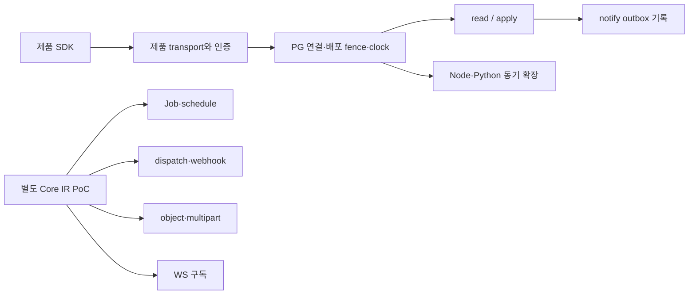

# SQL 편향 감사

2026-10-09. 제품 코드 기준 `ecf3369`. [최신 창시자 지침](../sources/founder-backend-capability-directive-2026-10-09.md)이 기준이며, 현재 parser를 최종 AIP 사양으로 정당화하지 않는다. 코드 근거 ID는 [sources](sources.md), 실행 증거는 [validation](validation.md).

## 판정

**AIP의 목표는 백엔드 반복 로직 전반을 흡수하는 프레임워크다. 현재 제품 실행 경로는 그 목표의 데이터·정책·전이 부분을 구현했으며, 비동기·외부 효과·파일·실시간을 포괄하는 제품 계약은 아직 부족하다.** root PoC에 더 넓은 기능이 있다는 사실은 중요한 재사용 근거지만 제품 지원으로 합산할 수 없다.

SQL을 잘 지원하는 것은 문제가 아니다. 문제는 SQL을 쓰지 않는 기능도 resource/PG 인증 연결/DB 배포 수명주기에 묶이고, 데이터 외 실행의 수락·진행·실패·취소·전달 의미를 같은 수준으로 발견·검증할 계약이 없다는 점이다. 이를 없애려고 기존 read/apply를 전면 교체할 근거도 없다.

## 세 가지 SQL-free를 구분

| 뜻 | 현재 제품 판정 | 확인 |
|---|---|---|
| 업무 코드가 SQL을 직접 작성하지 않음 | 가능. 표준 read/apply뿐 아니라 ctx를 쓰지 않는 확장 계산도 가능 | P02–P04/T01 |
| 비즈니스 테이블을 읽지 않는 계산 | 가능. 빈 access READ extension의 Node/Python 계산을 HTTP로 실행 | T01. transport harness이며 운영 IdP/배포 전 과정 실험은 아님 |
| PostgreSQL이 없는 서비스 | 불가. 제품 기동 preflight/bind wire, PG principal 검사, 요청 DB 연결/fence/clock 의존 | P06–P08. 의도적으로 연결 불가 DB를 준 transport에서도 DB_UNAVAILABLE |
| durable 상태 저장소 자체가 없는 장기 작업 | 보장 대상이 될 수 없음. 재개/진행/취소/재시도에는 영속 실행 상태가 필요 | 설계적 추론. 저장소가 업무 SQL DB여야 한다는 뜻은 아님 |

## 구조 원인과 영향

### 1. 실행 이름공간이 resource에 종속

최상위 선언은 enum/actor/predicate/access/limit/resource이며 extension은 resource 내부다(P01). 입력·출력이 데이터와 무관해도 `Resource.extension` 경로와 resource 선언이 필요하다. T01의 계산용 Compute resource도 테이블 DDL을 만든다. actor 선언 또한 필수다.

영향: 파일 병합·텍스트 계산·외부 조회 같은 작업의 계약을 표현하기 위해 저장형 resource를 추가하게 된다. resource 이름공간 자체가 항상 나쁘다는 뜻은 아니지만 저장·실행 선언을 분리할 선택지가 없다.

제안: 저장 모델이 없는 capability 계약을 검토한다. 기존 resource 확장의 호환 유지와 L1 표준 기능 호출을 먼저 고려하며 화면마다 새 command/DTO를 쓰게 하지 않는다.

### 2. 인가·배포·실행 컨텍스트의 PG 의존이 전 경로에 전파

제품 `serve`는 DB preflight와 wire binding을 먼저 수행한다(P08). 실제 작업은 PG 인증 연결 검사(P07), DB 연결→배포 shared lock/marker→DB clock을 거친다(P06). 비즈니스 SQL을 쓰지 않는 계산도 DB 장애에 묶인다.

이 장치들은 보안과 배포 일관성에 실제 역할이 있다. `effect none`이라는 문자열만 보고 fence를 생략하면 안 된다. 현재 none 확장도 ctx aggregate로 DB를 읽을 수 있다(P04). principal 폐기 검사도 DB를 읽는다.

제안: **효과 종류가 아니라 검증된 capability 의존성**으로 인증 provider/데이터 provider/배포 계약/clock/실행 상태 저장소를 구분한다. PG 없는 경로는 인증·폐기·계약 검증의 동등한 보호를 먼저 증명해야 한다.

### 3. 동기 응답 외의 실행 수명 계약 부재

`/status`는 이미 커밋한 `/apply` 결과를 principal+key+원 요청으로 조회하는 복구 계약이다(P06). Job의 queued/running/progress/cancel/result를 표현하지 않는다. HTTP를 닫은 뒤 처리하거나 worker crash 뒤 이어갈 제품 실행 상태가 없다.

**REQUEST_TIMEOUT=5초가 확장 전체 실행을 제한한다는 초기 독립 검토는 틀렸다.** T01에서 6초 Node/Python 동기 계산이 모두 반환됐다. 확장 선언 1초 deadline은 실제로 거부했다. 긴 동기 실행은 가능하지만 연결·DB 연결·worker slot을 계속 보유한다. 클라이언트 disconnect가 worker 중단으로 이어지는지는 이번에 미검증이다.

제안: 기존 status를 보존하고 별도 durable 실행 결과 계약을 검토한다. 단순 계산 모두를 queue에 넣을 필요는 없다. 작업 수락 영속화·lease·진행·취소 요청/확인·결과 만료를 전문 executor가 책임진다.

### 4. DB 효과와 외부 효과의 간극

제품 전이 효과는 create/update/notify다(P03). notify의 outbox 6열에는 delivery 상태와 payload snapshot이 없고 제품 consumer가 기동하지 않는다(P09). 따라서 알림 전송 완료가 아니라 전달 의도가 커밋됐다는 의미다.

worker ctx는 READ aggregate와 WRITE 공개 apply에 한정된다(P04). 제품 확장은 network deny이며 외부 HTTP/secret/file handle/progress broker가 없다. 직접 Node/Python 라이브러리 호출로 이 간극을 메우면 Runtime 권한·비용·멱등 계약 밖의 효과가 생긴다.

제안: 서버가 등록한 효과 capability, durable outbox/inbox, typed provider adapter를 우선 검토한다. DB commit과 결제/메일 완료를 하나의 트랜잭션이라고 부르지 않는다. 외부 timeout 뒤 결과 불명·재조회·보상도 계약에 포함한다.

### 5. transport·catalog가 현재 실행 영역에 닫힘

허용 라우트는 `/session,/read,/apply,/status,/extension`이며 bounded JSON만 받는다(P06). 관리형 upload/object/stream/WS/SSE 경로가 없다. 정적 SDK 계약은 있지만 실행 가능한 비데이터 capability를 설명하는 runtime catalog는 없다(P05).

새 기능마다 임의 handler를 붙이면 타입·인가·멱등·예산 검증이 경로마다 달라질 수 있다. 반대로 모든 실행을 하나의 거대한 opcode interpreter에 밀어 넣으면 특수 의미를 숨긴다.

제안: 공통 검증 envelope와 executor별 계약을 분리한다. 등록된 표준 기능의 발견과 생성 SDK를 공유하되 DB planner·queue·file/stream·realtime은 필요한 전문 실행기를 둔다.

## PoC를 활용하되 합산하지 않는다

PoC Step 전부가 SQL이라는 주장도 틀렸다(Q01). 일부 실행은 SQL에 결합되지만 Upload/Encrypt/NewId/Fail은 그렇지 않다. 서명·주소 검증·재시도 계산은 비교적 분리하기 쉬운 후보이고, 구독/Job은 Engine/plan/스키마 결합을 먼저 분석해야 한다. PoC 모듈을 무조건 폐기하거나 Core IR을 제품 facts에 직접 합치는 양쪽 모두 근거가 부족하다.

## 감사에서 확인한 안전 경계

- caller에게 임의 JS/Python 실행·secret 원문·임의 URL·무제한 queue를 열지 않는다.
- 제품 확장은 macOS 밖에서 설정이 거부된다(P06). Linux 운영 확장 경로는 현재 제품 지원으로 주장할 수 없다.
- MacNetDeny는 네트워크를 차단하지만 파일시스템 접근을 capability로 제한하지 않는다(P04). 서버가 배포한 확장을 곧 비신뢰 caller 코드로 취급하지는 않되, 관리형 file handle의 권한 보장으로 포장하면 안 된다.
- PostgreSQL 강제 제거, 모든 효과 동일 tx, 모든 동작 durable화, 화면별 named command 복원, 거대 DSL 도입은 이번 제안의 전제가 아니다.
- Level4에 반복되는 HTTP/파일/작업 lifecycle glue는 L1–3 후보이며, 가격 산식·문서 엔진·특수 알고리즘까지 모두 DSL화할 이유는 없다.
